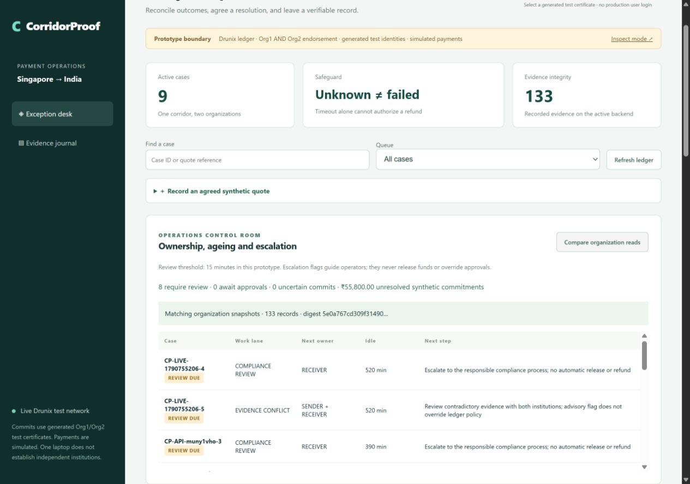
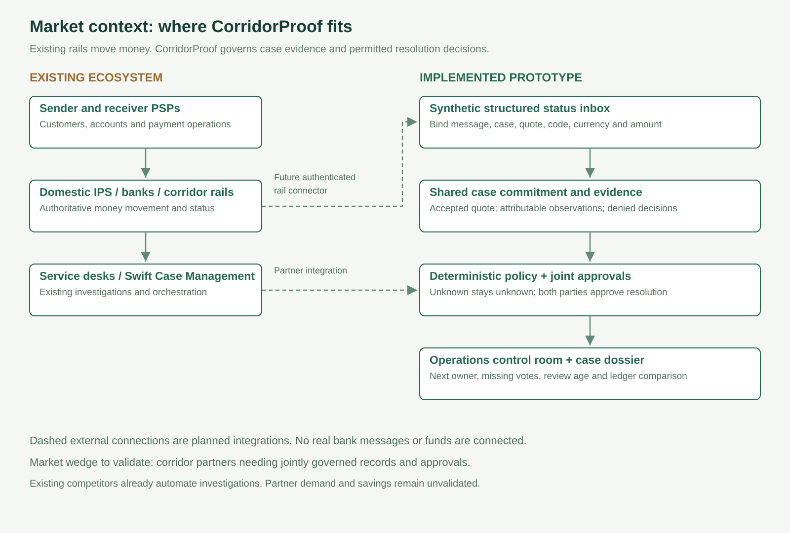
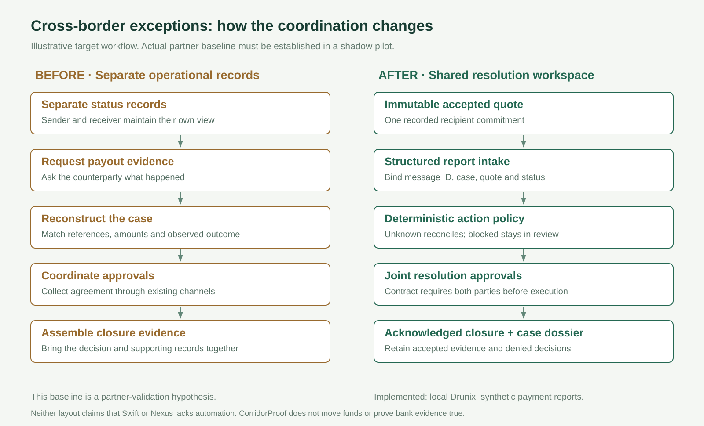
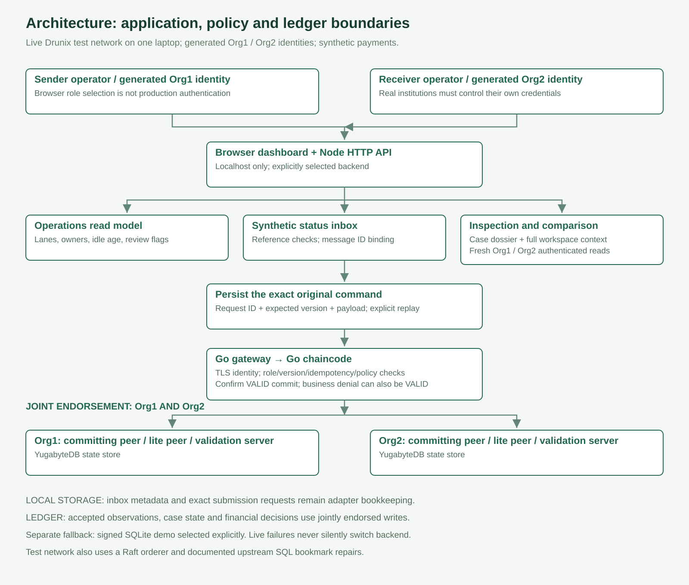
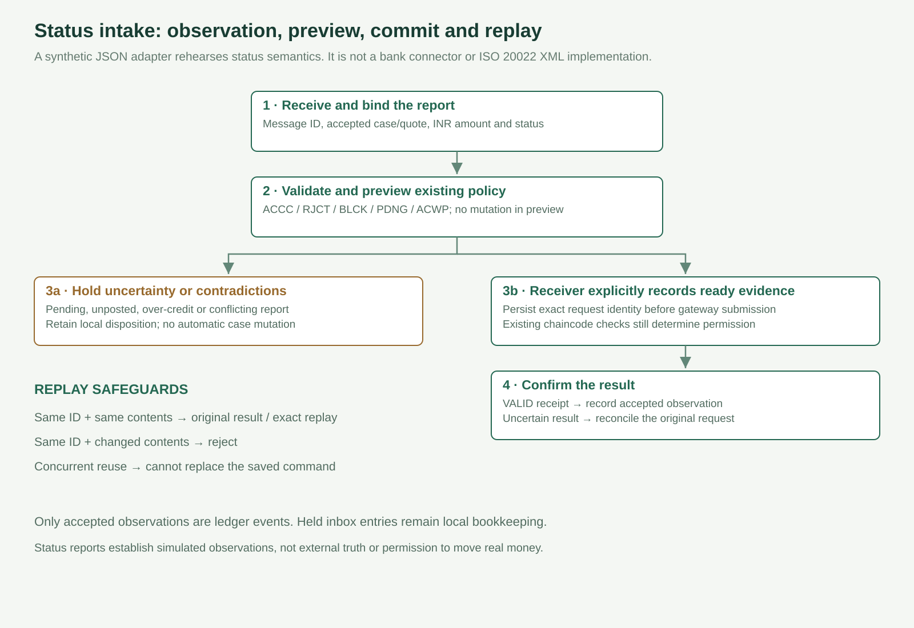
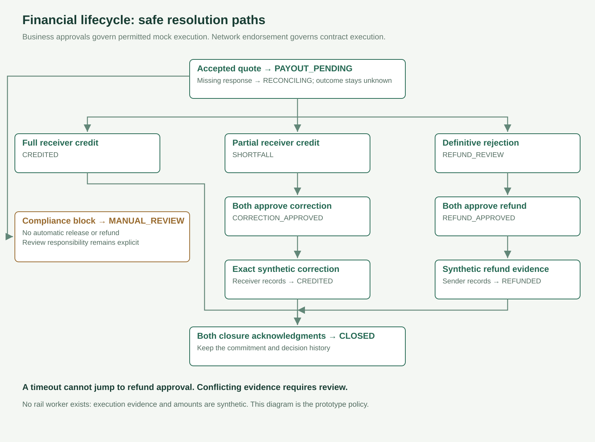

# CorridorProof

**Shared evidence and safe resolution for cross-border payment exceptions.**

A hackathon prototype for sender and receiver operations teams. It preserves the accepted recipient amount, records attributable payout evidence, and requires both organizations to approve a correction or refund. A missing payout response remains unknown. It cannot authorize a refund.

**Live dashboard verified on the local Drunix test network. Payments remain simulated.** The certificate-bound gateway connects the browser workflow to Go chaincode under Org1 AND Org2 endorsement. Five API scenarios passed with 36 VALID commits; an actual MVCC conflict, unauthorized MSP rejection and persistence after both lite peers restarted also passed. The live network uses two documented upstream SQL bookmark fixes. See [live dashboard setup](docs/LIVE-DASHBOARD.md), [API evidence](submission/drunix-dashboard-evidence.json) and [resilience evidence](submission/drunix-resilience-evidence.json). Generated test credentials on one laptop do not establish independent institutions. No NPCI sandbox, UPI connector or real funds are connected.

`npm start` defaults to the separately labelled **LOCAL_SIGNED_DEMO**. Use the documented environment configuration for **LIVE_DRUNIX_TEST_NETWORK**; live failures never silently switch to local data.



## Explicit Drunix use cases in CorridorProof

Drunix is the **permissioned execution and shared-record layer** in the live build. The financial workflow is our Go chaincode; it is not an off-the-shelf Drunix payment product. [NPCI's architecture](https://github.com/npci/drunix/blob/main/docs/drunix-arch.md) describes lite-peer endorsement, committing peers, stateless validation and SQL state storage. Our local network uses these components; their presence does not demonstrate production throughput or institutional independence.

| Project use case | How we use Drunix | Implemented evidence / boundary |
| --- | --- | --- |
| Record a shared recipient commitment | Store accepted synthetic quote terms and case state through chaincode | Original recipient amount remains the reference for shortfall decisions; no live FX price or rate reservation |
| Attribute actions to an organization | Derive sender/receiver role from the submitting certificate's MSP in Go chaincode | Unauthorized MSP rejection tested; the browser selector is only a test-identity harness |
| Enforce safe resolution permissions | Execute deterministic policy on peers: unknown cannot approve refund; corrections/refunds require both business votes | Live denial and approval scenarios passed; external evidence and execution remain synthetic |
| Govern writes jointly | Deployed chaincode endorsement requires `AND('Org1MSP.peer','Org2MSP.peer')` | Both organizations attest execution; endorsement is distinct from their analysts' business approval votes |
| Retain accepted and refused decisions | Commit case updates and attributable event records; confirm gateway commit status | VALID receipts observed, including recorded business denials; a VALID envelope does not mean a refused action was permitted |
| Prevent competing/stale updates and duplicate effects | Combine chaincode versions/idempotency with Drunix MVCC validation | Actual race produced one VALID commit and one MVCC conflict; exact application replay retrieves the original result |
| Reconcile counterparty views and survive restart | Query through each organization's authenticated gateway view; use committing peers and YugabyteDB state stores | Matching snapshots and persistence after both lite peers restarted tested; no independent production deployment or offline inclusion proof |

**Concrete Drunix-backed scenarios:** a timeout followed by late credit; a partial credit requiring exact correction approval; definitive rejection requiring refund approval; a compliance block held for manual review; and concurrent operators attempting conflicting updates. The operations control room and status adapter expose these workflows around the same financial contract.

**Outside the Drunix boundary:** inbox bookkeeping, review-age calculations and dossier packaging run in the Node adapter. Real settlement, bank-message authenticity, production user login, arbitration and compliance decisions require separate systems and authority. Private-data collections, tokenization and throughput scaling are potential platform capabilities, not features implemented or benchmarked in this project. The separate signed SQLite fallback does not use Drunix.

**When this is preferable to a database:** participants require separately controlled identities and jointly governed writes and are willing to operate the network. If a trusted central operator is acceptable, a shared database can implement the same workflow more simply. See the [competition and pitfalls audit](docs/COMPETITION-AND-PITFALLS.md) for qualification gates and remaining risks.

## The market gap: reliable decisions across organizational boundaries

The relevant market is **B2B cross-border exception operations**: sender and receiver payment providers, their corridor operator, and the operations/compliance teams that resolve missing status, recipient shortfalls and rejected payouts. It is not the entire UPI market, an FX exchange or a new settlement rail.

Three primary sources frame the opportunity:

- **Nexus documents the coordination requirement.** Its first-release design uses manual investigations, recalls and disputes through a Service Desk and describes possible future message automation. This is documentation of a requirement, not proof of every corridor's current deployed workflow. [Nexus key points](https://docs.nexusglobalpayments.org/payment-processing/key-points)
- **Status semantics matter.** Nexus distinguishes credited, pending, accepted-without-posting, rejected and blocked outcomes. Normal-priority missing responses invoke an exception process; high-priority cancellation has different rules. Our generic conservative policy must be mapped to a partner's actual scheme. [Payment priority](https://docs.nexusglobalpayments.org/payment-processing/time-critical-vs-non-time-critical-payments), [pacs.002 status reports](https://docs.nexusglobalpayments.org/messaging-and-translation/message-pacs.002-payment-status-report)
- **This is an established competitive category.** Swift offers validation, status-based responses, routing, reminders and investigation tracking. We do not claim these are missing from Swift. The FSB's cross-border programme addresses cost, speed, transparency and access; our narrow contribution concerns exception coordination and transparency, not demonstrated macroeconomic improvement. [Swift Case Management](https://www.swift.com/products/case-management), [FSB cross-border programme](https://www.fsb.org/work-of-the-fsb/financial-innovation-and-structural-change/cross-border-payments/)

**Our proposed wedge:** a corridor pair wants its case commitment, evidence and financial-resolution approvals governed jointly, integrated with its status systems, rather than controlled solely by one case-system operator. This is a buyer hypothesis. A qualified partner must confirm what its current service desk, Swift/Nexus capabilities or shared database does not already solve.

### Which gaps the prototype addresses

| Operational gap / scenario | Why addressing it matters | Implemented response | Evidence and boundary |
| --- | --- | --- | --- |
| Missing response is mistaken for a final outcome | A follow-up decision needs the real payout state | Unknown remains reconciliation; timeout cannot authorize refund | Core Node/Go fixtures and live denied-refund receipt; conservative prototype rule |
| Status messages arrive with inconsistent references or semantics | A correct message applied to the wrong case can corrupt a decision | Synthetic JSON normalizer checks case/quote/currency/amount; PDNG and ACWP are held | Adapter tests; no XML parser, bank authentication or ISO certification |
| Duplicate reports or a reused ID carry different contents | Replay can create repeated effects or disguise contradictory evidence | Durable message-ID/content binding; exact command replay; changed contents rejected | Inbox survives restart; local metadata, applied observations use the active ledger |
| Ownership and approval waiting are unclear | Cases can stall while each team expects the other to act | Lane, next owner, idle age, missing approvals and review-due queue | Derived from current state/events; 15-minute review threshold is a demo configuration |
| Evidence conflicts or a compliance block needs escalation | Automation must not invent a final bank outcome | Contradictory reports held; ledger conflicts/compliance cases highlighted; manual review remains explicit | No automated arbitration or compliance-release authority |
| Audit records are scattered across case state and event exports | Operators need the accepted quote, decision history and verification context together | Per-case dossier includes events, current state, operations context, digest and full workspace | Convenience packet; digest alone does not establish provenance |
| Counterparties need to compare their views | A single UI view does not establish shared recorded state | Fresh authenticated Org1 and Org2 queries with canonical digest comparison | Sequential reads; concurrent commits can produce differences; local credentials do not prove real independence |

### Where CorridorProof sits



<details>
<summary>Editable Mermaid source</summary>

```text
flowchart TB
  subgraph Existing["Existing payments and operations ecosystem"]
    Customer["Sender / recipient"] --> PSP["Sender and receiver PSPs"]
    PSP --> Rails["Domestic IPS / banks / corridor rails
Authoritative money movement"]
    Rails --> Status["Rail status and investigation messages"]
    Desk["Existing service desks / Swift Case Management
Validation, orchestration and investigations"]
    Status --> Desk
  end
  subgraph CP["CorridorProof's proposed integration position"]
    Adapter["Structured status adapter
Synthetic JSON implemented"] --> Case["Shared case commitment and evidence"]
    Case --> Rules["Deterministic permitted-action policy"]
    Rules --> Joint["Both-party resolution approvals
Drunix jointly endorsed state"]
    Joint --> Ops["Ownership / ageing / escalation / audit dossier"]
  end
  Status -. "Future authenticated connector" .-> Adapter
  Desk -. "Partner-specific integration hypothesis" .-> Case
  Joint -. "Future idempotent execution adapter" .-> Rails
```

</details>

Solid lines inside CorridorProof describe implemented components. Dashed external links are future integrations. The app is an exception decision component alongside payment infrastructure, not a replacement for it.

### Before / after workflow



The comparison is a target partner workflow to validate, not a universal baseline or measured improvement. A pilot must establish whether shared rules actually reduce handoffs, evidence rework and unsafe attempted actions.

### Detailed implementation and trust boundaries



<details>
<summary>Editable Mermaid source</summary>

```text
flowchart TB
  Sender["Sender operator
Generated Org1 identity"] --> UI["Browser operations desk"]
  Receiver["Receiver operator
Generated Org2 identity"] --> UI
  UI --> API["Node HTTP API
Localhost / explicit backend"]
  API --> Ops["Operations read model
Lanes, owners, ageing, review flags"]
  API --> Inbox["Synthetic status inbox
Reference validation / duplicate binding"]
  Inbox --> Requests["Persist exact command identity
Uncertain result blocks replacement"]
  API --> Requests
  Requests --> GW["Go gateway
TLS identity / await VALID commit"]
  GW --> Contract["Go chaincode
Role + version + idempotency + financial rules"]
  Contract --> Endorse["Org1 AND Org2 endorsement"]
  Endorse --> O1["Org1 committing peer / lite peer / validation server"]
  Endorse --> O2["Org2 committing peer / lite peer / validation server"]
  O1 --> DB1["Org1 YugabyteDB state store"]
  O2 --> DB2["Org2 YugabyteDB state store"]
  GW --> Receipt["Validation receipt
Business denial may also be VALID"]
  Receipt --> UI
  Ops --> Packet["Case dossier + full verification context"]
  API --> Compare["Fresh Org1 / Org2 snapshot comparison"]
  API --> Fallback["Separate local signed SQLite backend
Selected explicitly; no silent fallback"]
```

</details>

Status-inbox metadata and saved submission identities live in ignored adapter storage. **Accepted observations and financial case decisions live on the selected ledger.** SLA/ageing labels are derived views, never consensus triggers. The local API holds both generated credentials; production needs separate institutional custody and user authentication.

### Structured status intake sequence



<details>
<summary>Editable Mermaid source</summary>

```text
sequenceDiagram
  actor R as Receiver operator
  participant I as Status inbox
  participant P as Policy preview
  participant G as Gateway
  participant D as Drunix contract
  R->>I: Synthetic message ID, case, quote, code, amount
  I->>I: Validate references and bind message contents
  I->>P: Normalize ACCC / RJCT / BLCK / PDNG / ACWP
  alt Pending, unposted, over-credit or contradictory
    P-->>I: Hold for review; no automatic case mutation
    I-->>R: Retained local inbox disposition
  else Permitted observation
    P-->>R: Preview next state
    R->>I: Explicitly record ready evidence
    I->>I: Persist exact command before submit
    I->>G: Original request ID and expected version
    G->>D: Submit under receiver test certificate
    D->>D: Check role, idempotency, version and case policy
    D-->>G: Commit validation result
    G-->>R: VALID receipt or uncertain outcome
  end
  Note over I,D: Exact replay reuses the original command; changed message contents are rejected
```

</details>

### Financial lifecycle



<details>
<summary>Editable Mermaid source</summary>

```text
stateDiagram-v2
  [*] --> PAYOUT_PENDING: Accepted synthetic quote
  PAYOUT_PENDING --> RECONCILING: Missing response
  PAYOUT_PENDING --> CREDITED: Full receiver credit
  RECONCILING --> CREDITED: Late full receiver credit
  PAYOUT_PENDING --> SHORTFALL: Partial receiver credit
  RECONCILING --> SHORTFALL: Partial receiver credit
  SHORTFALL --> CORRECTION_APPROVED: Both organizations approve
  CORRECTION_APPROVED --> CREDITED: Receiver records exact synthetic correction
  PAYOUT_PENDING --> REFUND_REVIEW: Definitive receiver rejection
  RECONCILING --> REFUND_REVIEW: Definitive receiver rejection
  REFUND_REVIEW --> REFUND_APPROVED: Both organizations approve
  REFUND_APPROVED --> REFUNDED: Sender records synthetic refund
  PAYOUT_PENDING --> MANUAL_REVIEW: Compliance block
  RECONCILING --> MANUAL_REVIEW: Compliance block
  CREDITED --> CLOSED: Both closure acknowledgments
  REFUNDED --> CLOSED: Both closure acknowledgments
  CLOSED --> [*]
```

</details>

Unknown has no direct refund path. MANUAL_REVIEW has no invented automated release path. Financial approvals differ from network endorsement: business votes authorize a resolution; peers endorse contract execution.

### Commercial scope and validation

Start with **one PSP pair, one corridor and a shadow pilot**, using de-identified exceptions. Compare existing workflows and a trusted shared database with the jointly governed ledger. Measure operator minutes, evidence requests, repeated work, approval waiting, completeness of closure and denied unsafe attempts. Keep rail waiting separate from application time. Subscription plus integration/support is a business-model hypothesis, not validated pricing.

No defensible TAM or savings percentage has been established. The first addressable segment is providers with a confirmed unmet joint-governance/integration requirement; payment volume alone is not our market size. See [detailed gap analysis](docs/MARKET-GAP.md) and [feature/trust matrix](docs/OPERATIONS.md).

## Run the demo

Install [Node.js 24 LTS](https://nodejs.org/en/download). No application packages or API keys are required for the local fallback. Live mode requires the separately documented Drunix network and generated test credentials.

Extract the source ZIP or clone the published repository, then run this from the project directory:

```sh
npm start
```

Open **http://127.0.0.1:8787**. Node's built-in SQLite currently emits an experimental-feature notice. The demo intentionally binds only to localhost and uses a role selector, not production authentication. Do not expose it to a public network.

Fresh runs create synthetic cases and signing keys in ignored `.data/`. State survives restart. For a fresh demo without deleting earlier evidence, set `CORRIDORPROOF_DATA` to a new directory before starting. PowerShell:

```powershell
$env:CORRIDORPROOF_DATA = '.data/demo-2'
npm.cmd start
```

## Financial scenarios and operations features

| Case | Steps | Safety property |
| --- | --- | --- |
| CP-001: missing response | Sender simulates timeout, tests blocked refund. Receiver records late credit. Each party acknowledges closure. | Unknown outcome cannot authorize refund. |
| CP-002: shortfall | Receiver records INR 6,080 credit against INR 6,200 commitment. Both parties approve. Receiver records mock INR 120 correction. Both acknowledge closure. | One organization cannot authorize correction alone. |
| CP-003: rejection | Receiver records definitive rejection. Both approve refund. Sender records mock refund. Both acknowledge closure. | Refund requires rejection evidence and both approvals. |

The receiver can also record a compliance block. It requires manual review and offers no automatic refund. Contradictory evidence is rejected and recorded for operator escalation. Human arbitration and compliance release are outside this prototype. The operations queue makes review ownership and ageing visible without overriding the contract.

## Verification

```sh
npm test
npm run demo:check
npm run test:campaign
# Explicitly live backend only:
node scripts/operations-live-check.js
cd chaincode
go test ./...
cd ../gateway
go build ./...
```

The Node and Go policies use the same conformance scenarios. Go mock-stub tests also check MSP restrictions, persisted business denials and idempotency. These tests do not prove distributed endorsement or live rail behavior.

In local mode use **Verify signatures**; in live mode use **Compare with live ledger**. Both modes offer **Test altered evidence** and **Export JSON**. The live verifier compares against the current authenticated query and does not verify offline block signatures or inclusion proofs. The tamper demonstration changes only an in-memory export copy. It never changes the stored journal.

```sh
npm run verify -- corridorproof-evidence.json
npm run verify -- corridorproof-evidence.json independently-pinned-public-keys.json
```

Verification checks signatures, hash links, sequence, supplied head and reconstructed case states. Embedded keys establish consistency only. Independently pinned public keys and previously witnessed heads are required to detect identity substitution or rewritten/truncated history. A statement signed by a bank still needs authoritative rail reconciliation.

## Reproducible reliability simulations

The overnight campaign passed **94,720 seeded policy attempts** across three distinct seed ranges and **2,040 isolated localhost HTTP requests**, including controlled malformed inputs. All 27 Node regression tests pass, including 24 injected lost-acknowledgment recovery variants and failed-storage retries. The storage wave repaired a retry that could bypass persistence of its original command and added fail-closed checks for corrupt adapter files. Separate modest live checks reached matching organization views at 137 events; the latest initial comparison failed transiently before two matching follow-up reads, as disclosed in the evidence. Large simulations are not live-chain throughput measurements. The [validation record](docs/VALIDATION.md) reports realized accepted/denied counts, response distributions and limits; the [campaign guide](docs/OVERNIGHT-CAMPAIGN.md) documents reproducible commands and the next fault profiles.

## Repository map

- `src/`: deterministic policy, transactional SQLite journal, integrity verifier and HTTP API.
- `public/`: browser-native dashboard, no build step or external CDN.
- `test/`: Node checks and shared policy conformance fixtures.
- `chaincode/`: Go shim chaincode with MSP authorization and version/idempotency safeguards.
- `gateway/`: TLS and certificate-bound Go Gateway used by the live Node adapter.
- `docs/`: architecture, evidence register, API, setup, threats, pilot, submission and demo script.
- `DECISIONS.md`: decisions and tradeoffs.

Pitch: [submission PDF](submission/CorridorProof-pitch-expanded.pdf) and [editable PPTX](submission/CorridorProof-pitch-expanded.pptx). The ten-slide expanded deck includes structured status intake and the operations control room.

## Why a ledger?

Independent corridor participants can jointly govern accepted evidence and resolution changes without handing unilateral edit authority to one operator. **A trusted shared database remains a valid alternative.** The ledger is valuable only if partners need independent governance and will run separate identities/nodes. The local demo does not establish that independence.

## Evidence and commercial hypothesis

Nexus documentation describes manual investigations, recalls and disputes in its first release. Swift already offers Case Management. We therefore propose a narrow integration and joint-governance hypothesis for corridor exception operations, not a claim that payment investigations are a new category. See [evidence and competitor review](docs/EVIDENCE.md).

Candidate buyer: payment operations teams at corridor PSPs or a corridor operator. Candidate product: subscription plus integration, priced after observing case volume and staff time. No customer interviews, willingness-to-pay, deployed partner pilot, savings estimate or market-share claim has been validated.

## Pitfalls and next build priorities

The [three-pass audit](docs/COMPETITION-AND-PITFALLS.md) reviews source claims and competition, domain/trust boundaries, then implementation and commercial delivery. Its highest-priority findings are:

- **Evidence truth and real settlement:** a certificate or ledger entry cannot prove that a bank credited funds. Production requires authenticated rail reports, payment-reference binding and an idempotent execution/inquiry adapter. No cross-rail atomicity is claimed.
- **Independent governance:** both generated credentials currently live on one laptop. Real deployment requires separate institutional custody, authenticated operators and agreed upgrade, exit and dispute authority.
- **Liveness and conflicting reports:** two-party approval can stall. Held inbox conflicts are advisory and do not automatically freeze contract permissions. Partners must decide whether to introduce a governed on-ledger dispute state and how it is resolved.
- **Operational scale:** workspace export is bounded at 1,000 records; full-workspace dossiers and local JSON bookkeeping need scoped pagination and transactional storage before a production service. The disclosed Drunix patches need a reproducible supported build.
- **Competitive and commercial fit:** Swift and central workflow systems may already meet the buyer's need. Continue only if a partner confirms an unmet requirement and the integration/operating cost is justified.

Keep the tested financial contract stable for the hackathon. Next prioritize partner qualification, authenticated ingress and operator access, protected durable adapter storage, and independent deployments. Add real execution only after scheme semantics and fault recovery are validated. A central database deployment remains a sensible alternative when joint ledger governance is unnecessary.

**License:** Apache-2.0. No affiliation, endorsement or production approval from NPCI, Nexus or Swift is claimed.
