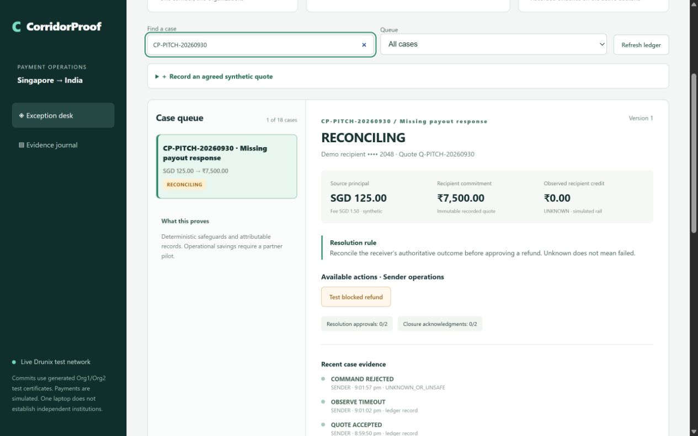

# CorridorProof

**Shared evidence and safe resolution for cross-border payment exceptions.**

A hackathon prototype for sender and receiver operations teams. It preserves the accepted recipient amount, records attributable payout evidence, and requires both organizations to approve a correction or refund. A missing payout response remains unknown. It cannot authorize a refund.

**Live dashboard verified on the local Drunix test network. Payments remain simulated.** The certificate-bound gateway connects the browser workflow to Go chaincode under Org1 AND Org2 endorsement. Five API scenarios passed with 36 VALID commits; an actual MVCC conflict, unauthorized MSP rejection and persistence after both lite peers restarted also passed. The live network uses two documented upstream SQL bookmark fixes. See [live dashboard setup](docs/LIVE-DASHBOARD.md), [API evidence](submission/drunix-dashboard-evidence.json) and [resilience evidence](submission/drunix-resilience-evidence.json). Generated test credentials on one laptop do not establish independent institutions. No NPCI sandbox, UPI connector or real funds are connected.

`npm start` defaults to the separately labelled **LOCAL_SIGNED_DEMO**. Use the documented environment configuration for **LIVE_DRUNIX_TEST_NETWORK**; live failures never silently switch to local data.



## Run the demo

Install [Node.js 24 LTS](https://nodejs.org/en/download). No application packages or API keys are required.

Extract the source ZIP or clone the published repository, then run this from the project directory:

```sh
npm start
```

Open **http://127.0.0.1:8787**. Node's built-in SQLite currently emits an experimental-feature notice. The demo intentionally binds only to localhost and uses a role selector, not production authentication. Do not expose it to a public network.

Fresh runs create synthetic cases and signing keys in ignored `.data/`. State survives restart. For a fresh demo without deleting earlier evidence, set `CORRIDORPROOF_DATA` to a new directory before starting. PowerShell:

```powershell
$env:CORRIDORPROOF_DATA = '.data/demo-2'
npm.cmd start
```

## Three scenarios

| Case | Steps | Safety property |
| --- | --- | --- |
| CP-001: missing response | Sender simulates timeout, tests blocked refund. Receiver records late credit. Each party acknowledges closure. | Unknown outcome cannot authorize refund. |
| CP-002: shortfall | Receiver records INR 6,080 credit against INR 6,200 commitment. Both parties approve. Receiver records mock INR 120 correction. Both acknowledge closure. | One organization cannot authorize correction alone. |
| CP-003: rejection | Receiver records definitive rejection. Both approve refund. Sender records mock refund. Both acknowledge closure. | Refund requires rejection evidence and both approvals. |

The receiver can also record a compliance block. It requires manual review and offers no automatic refund. Contradictory evidence is rejected and recorded for operator escalation. Human arbitration and compliance release are outside this prototype.

## Verification

```sh
npm test
npm run demo:check
cd chaincode
go test ./...
cd ../gateway
go build ./...
```

The Node and Go policies use the same conformance scenarios. Go mock-stub tests also check MSP restrictions, persisted business denials and idempotency. These tests do not prove distributed endorsement or live rail behavior.

In local mode use **Verify signatures**; in live mode use **Compare with live ledger**. Both modes offer **Test altered evidence** and **Export JSON**. The live verifier compares against the current authenticated query and does not verify offline block signatures or inclusion proofs. The tamper demonstration changes only an in-memory export copy. It never changes the stored journal.

```sh
npm run verify -- corridorproof-evidence.json
npm run verify -- corridorproof-evidence.json independently-pinned-public-keys.json
```

Verification checks signatures, hash links, sequence, supplied head and reconstructed case states. Embedded keys establish consistency only. Independently pinned public keys and previously witnessed heads are required to detect identity substitution or rewritten/truncated history. A statement signed by a bank still needs authoritative rail reconciliation.

## Repository map

- `src/`: deterministic policy, transactional SQLite journal, integrity verifier and HTTP API.
- `public/`: browser-native dashboard, no build step or external CDN.
- `test/`: Node checks and shared policy conformance fixtures.
- `chaincode/`: Go shim chaincode with MSP authorization and version/idempotency safeguards.
- `gateway/`: TLS and certificate-bound Fabric Gateway CLI. Separate from local server.
- `docs/`: architecture, evidence register, API, setup, threats, pilot, submission and demo script.
- `DECISIONS.md`: decisions and tradeoffs.

Latest pitch: [CorridorProof-pitch-live.pptx](submission/CorridorProof-pitch-live.pptx). It supersedes the earlier deck's infrastructure status.

## Why a ledger?

Independent corridor participants can jointly govern accepted evidence and resolution changes without handing unilateral edit authority to one operator. **A trusted shared database remains a valid alternative.** The ledger is valuable only if partners need independent governance and will run separate identities/nodes. The local demo does not establish that independence.

## Evidence and commercial hypothesis

Nexus documentation describes manual investigations, recalls and disputes in its first release. Swift already offers Case Management. We therefore propose a narrow integration and joint-governance hypothesis for corridor exception operations, not a claim that payment investigations are a new category. See [evidence and competitor review](docs/EVIDENCE.md).

Candidate buyer: payment operations teams at corridor PSPs or a corridor operator. Candidate product: subscription plus integration, priced after observing case volume and staff time. No customer interviews, willingness-to-pay, deployed partner pilot, savings estimate or market-share claim has been validated.

**License:** Apache-2.0. No affiliation, endorsement or production approval from NPCI, Nexus or Swift is claimed.
