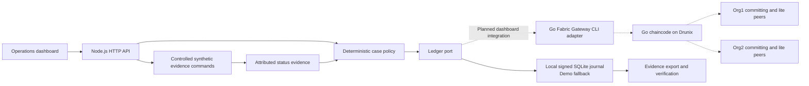

# CorridorProof architecture

Decision date: 30 September 2026. Submission deadline: 23:59 IST, as supplied by the user. Scope: evidence and exception resolution for one synthetic Singapore-to-India corridor.

## System boundaries

CorridorProof records commitments, attributes payment evidence and coordinates exception decisions between a sender institution (Org1) and a receiver institution (Org2). External payment rails remain authoritative for money movement. This application cannot promise atomic settlement, lower FX prices, liquidity, regulatory approval or automatic recovery of blocked funds.

The diagram distinguishes the executable local fallback from the live integration path. The Go gateway is a standalone certificate-bound CLI adapter; the dashboard is currently local-only and does not switch to live mode. README/health/UI disclose the actual mode. A local journal is not a distributed network. Two local role keys do not constitute independent institutions.

## Stack

Node.js 24 LTS supplies the HTTP server, SQLite transactions, Ed25519 signatures, SHA-256 and test runner. Browser-native JavaScript and CSS supply the dashboard without a bundler or CDN. Go supplies Fabric-compatible chaincode and gateway bridge. Linux, Docker, Go and jq are required for the official Drunix network. This minimizes installation risk on Windows and supports a one-command local demo.

## Data and trust

Transfer: immutable accepted quote, integer source/destination minor units, currency pair, pseudonymous beneficiary, expected recipient amount, observed payout state/amount, exception status, resolution votes, version.

Evidence event: case ID, event type, submitting organization, transaction/request ID, timestamp, evidence payload, previous hash, event hash and organization signature. Demo keys are generated locally and ignored by Git. No raw KYC, PIN, bank credential or real recipient data enters the demo.

Private data and independent certificates are required for live institutions. Public-channel records should contain minimum case state and commitments, not customer documents. Queries and writes require role-specific authorization. Endorsement is separate from caller access control.

## Policy and lifecycle

Normal path: PAYOUT_PENDING then CREDITED then jointly acknowledged CLOSED.

Missing acknowledgment: RECONCILING retains unknown status. A late authoritative credit resolves uncertainty. No timeout alone authorizes a retry or refund.

Recipient shortfall: SHORTFALL records the exact gap. Both organizations approve a correction. The mock adapter supplies correction evidence before closure.

Definitive rejection: both organizations approve a refund. Only then may a controlled command record mock refund evidence. Compliance BLOCKED requires review and cannot automatically refund. Contradictory evidence is rejected and recorded with a manual-escalation message. Arbitration and evidence correction after a conflict are future work.

State mutations use optimistic versions and idempotency keys. Stale commands and denied business actions produce attributable rejection records without changing transfer state. SQLite atomically persists state, journal and idempotency result. In live mode, the gateway must await VALID commit before any adapter action.

## Proof and limitations

Tests cover unknown outcomes, delayed success, refunds after definitive rejection, dual authorization, shortfall correction, replay/conflicting idempotency keys, stale versions, signature/evidence integrity, persisted restart and role restrictions. Go mock-stub tests prove chaincode logic only. They cannot prove Drunix endorsement, private-data sharing, concurrency validation, failover or national-scale performance.

The prototype records synthetic evidence and does not run a payment worker. It cannot prevent an external institution from paying outside the application. Signed statements prove their origin and unchanged content, not truth at the external bank. Network governance must define escalation, corrections, access, retention, dispute responsibility and participant exit.

## Infrastructure and release

Local: one process, localhost:8787, SQLite under ignored .data/, synthetic seed fixtures, no cloud account required. Docker packaging is optional. Live: pinned official Drunix checkout, two organizations, Go chaincode, trusted TLS gateway credentials and protected operational secrets. CI runs Node tests and Go tests. External hosting is separate from the core acceptance gate.

Release gate: clean clone starts, meaningful tests pass, mode labels match reality, repository contains no generated private keys, evidence exports verify, pitch cites sources and implemented functionality, repo/deck links are accessible. Record evidence in VALIDATION.md. A production pilot requires real rail contracts and institutional data/governance agreements.
